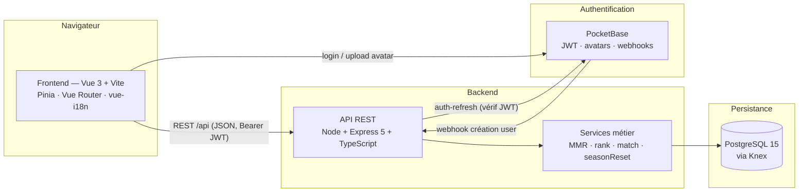
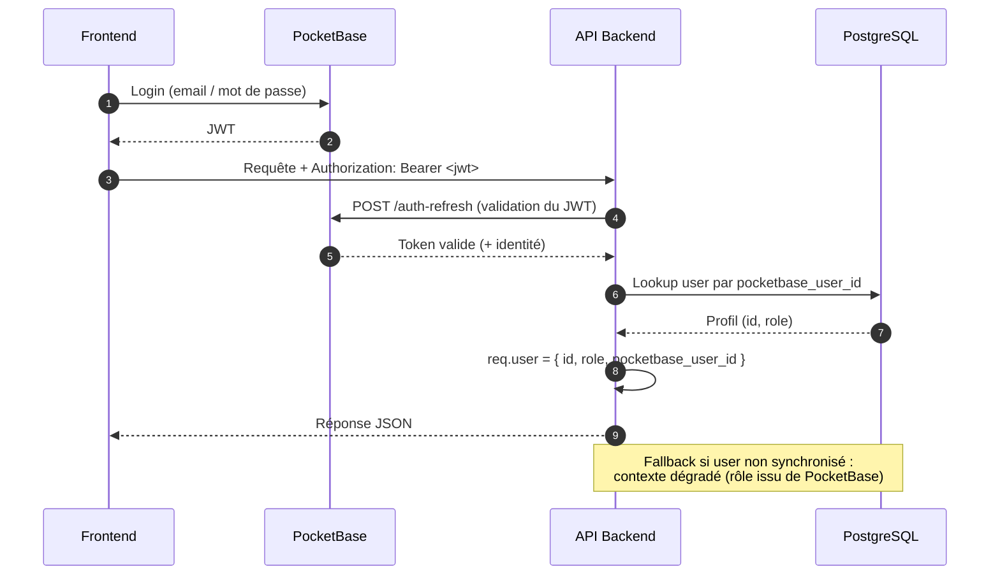
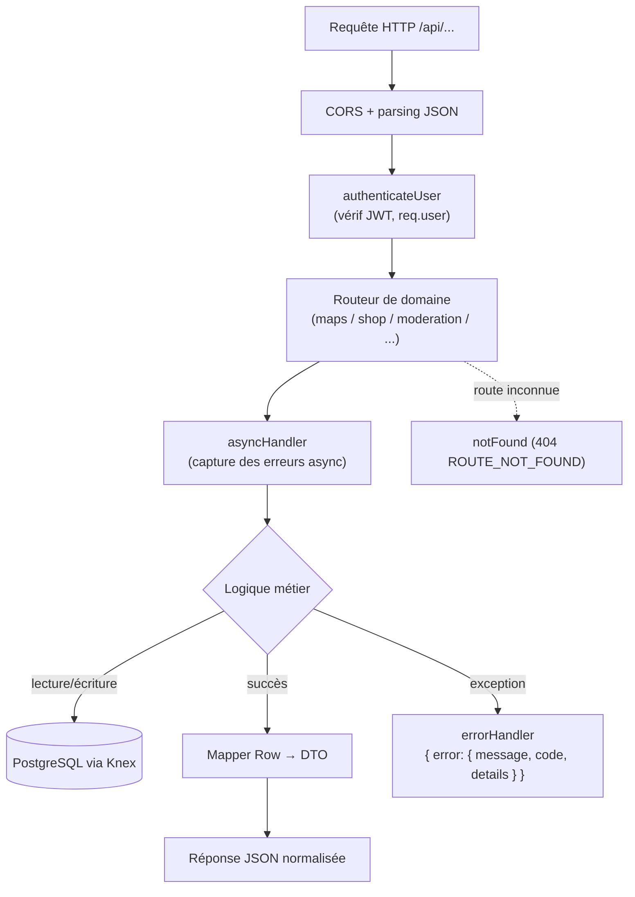
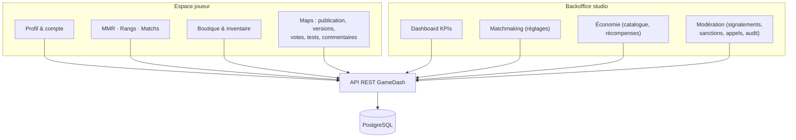
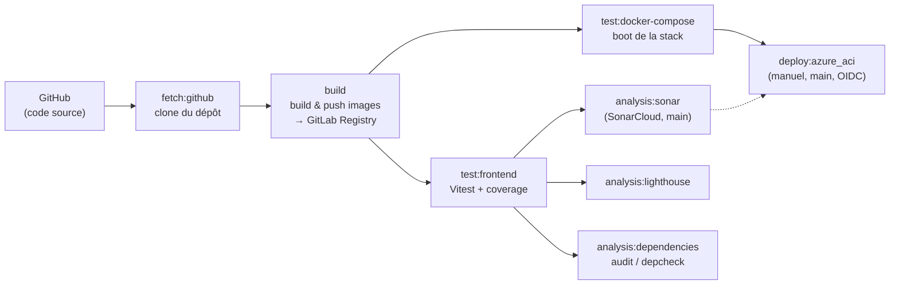
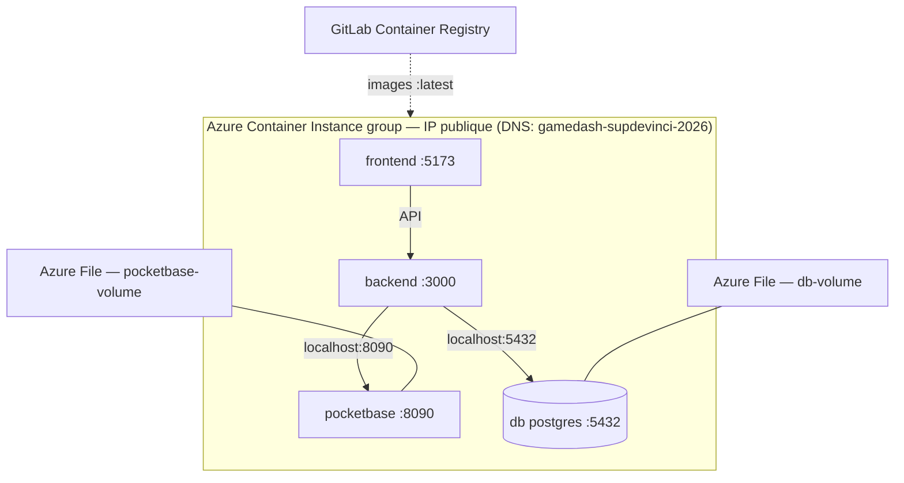

# Architecture — GameDash

Ce document présente l'architecture de **GameDash** sous forme de diagrammes (Mermaid). Il complète le `README` et la documentation technique.

---

## 1. Vue d'ensemble (conteneurs)

Architecture modulaire en couches : SPA cliente, API REST stateless, base relationnelle, et service d'authentification dédié (PocketBase).

**Principes :** séparation des services (identité PocketBase ↔ domaine PostgreSQL), découpage par domaine (maps, shop, moderation, mmr, matches, backoffice…), API stateless, données initiales déterministes (seeds). Le frontend ne parle **jamais** directement à la base ; le backend est l'unique point d'accès.

---

## 2. Flux d'authentification

La synchronisation des comptes est aussi assurée par un **webhook** PocketBase (`POST /api/pocketbase-webhook/users`) qui crée l'utilisateur PostgreSQL absent.

---

## 3. Cycle d'une requête API

---

## 4. Domaines fonctionnels

---

## 5. Chaîne CI/CD (GitLab)

Le code est hébergé sur **GitHub** (`vikorb/gameDash`) ; le pipeline s'exécute sur **GitLab CI**, qui récupère d'abord le dépôt GitHub.

Les jobs d'analyse sont informatifs (`allow_failure`) ; le déploiement est **manuel** sur `main` et conditionné à la réussite du build et des tests.

---

## 6. Déploiement (Azure Container Instances)

Déploiement sous forme d'un **container group** unique (région `germanywestcentral`) : les conteneurs partagent le réseau et communiquent via `localhost`.

Les images proviennent de la **GitLab Container Registry** ; la persistance s'appuie sur des volumes **Azure File** ; les secrets sont injectés au déploiement (`envsubst` + variables CI/CD protégées).

> ⚠️ La base PostgreSQL est exposée publiquement (port `5432`) dans ce manifeste : à restreindre pour un usage réel (Key Vault, suppression du port public).
