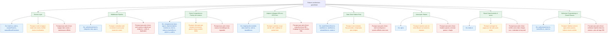

# Patterns Architecture - Mermaid

Copie-colle ce bloc dans Mermaid Live Editor, Notion, ou tout outil compatible Mermaid.

```mermaid
flowchart TD;
    A[Patterns architecture - gameDash];

    A --> P1[Service Layer];
    P1 --> P1U[Ou: match.ts, rank.ts, seasonReset.ts, seasonResetFormula.ts];
    P1 --> P1W[Pourquoi: sortir la logique metier des routes, faciliter tests et reutilisation];
    P1 --> P1N[Pourquoi pas autre chose: logique dans routes = maintenance difficile];

    A --> P2[Middleware Pipeline];
    P2 --> P2U[Ou: authenticateUser.ts, integration dans app.ts];
    P2 --> P2W[Pourquoi: centraliser auth et controle d acces pour toutes les routes];
    P2 --> P2N[Pourquoi pas autre chose: auth repetee endpoint par endpoint = oublis et duplication];

    A --> P3[Route Composition et Factory de routeurs];
    P3 --> P3U[Ou: enregistrement dans app.ts, implementations matches.ts, mmr.ts, ranks.ts, backoffice.ts, admin.ts, audit.ts];
    P3 --> P3W[Pourquoi: decouper par domaine fonctionnel, garder chaque module lisible];
    P3 --> P3N[Pourquoi pas autre chose: routeur monolithique vite ingerable];

    A --> P4[Adapter et Mapper DB vers DTO front];
    P4 --> P4U[Ou: mapping des resultats dans match.ts, rank.ts, backoffice.ts];
    P4 --> P4W[Pourquoi: controler ce qui sort de l API, stabiliser le contrat front];
    P4 --> P4N[Pourquoi pas autre chose: exposition brute DB = couplage fort front schema SQL];

    A --> P5[State Store Pattern Pinia];
    P5 --> P5U[Ou: matchHistoricStore.ts, rankStore.ts, rateStore.ts, winrateStore.ts, ranks.ts];
    P5 --> P5W[Pourquoi: etat centralise, flux previsible, composants plus simples];
    P5 --> P5N[Pourquoi pas autre chose: etat local disperse = synchro difficile entre vues];

    A --> P6[Interceptor Pattern];
    P6 --> P6U[Ou: api.ts];
    P6 --> P6W[Pourquoi: injection auto du token Bearer sur toutes les requetes];
    P6 --> P6N[Pourquoi pas autre chose: headers ajoutes a la main partout = fragile];

    A --> P7[Route Guard controle d acces];
    P7 --> P7U[Ou: index.ts];
    P7 --> P7W[Pourquoi: proteger les pages par role auth avant rendu];
    P7 --> P7N[Pourquoi pas autre chose: verifier acces dans chaque vue = redondant et trop tard];

    A --> P8[Defensive Programming et Guard Clauses];
    P8 --> P8U[Ou: authenticateUser.ts, backoffice.ts, match.ts];
    P8 --> P8W[Pourquoi: fiabiliser entrees types token params, reduire erreurs runtime];
    P8 --> P8N[Pourquoi pas autre chose: confiance implicite dans les entrees = plus de bugs 500];

    classDef pattern fill:#E6F4EA,stroke:#2E7D32,stroke-width:1px,color:#1B5E20;
    classDef where fill:#E3F2FD,stroke:#1565C0,stroke-width:1px,color:#0D47A1;
    classDef why fill:#FFF8E1,stroke:#F9A825,stroke-width:1px,color:#E65100;
    classDef whyNot fill:#FDECEA,stroke:#C62828,stroke-width:1px,color:#8E0000;

    class P1,P2,P3,P4,P5,P6,P7,P8 pattern;
    class P1U,P2U,P3U,P4U,P5U,P6U,P7U,P8U where;
    class P1W,P2W,P3W,P4W,P5W,P6W,P7W,P8W why;
    class P1N,P2N,P3N,P4N,P5N,P6N,P7N,P8N whyNot;
```
